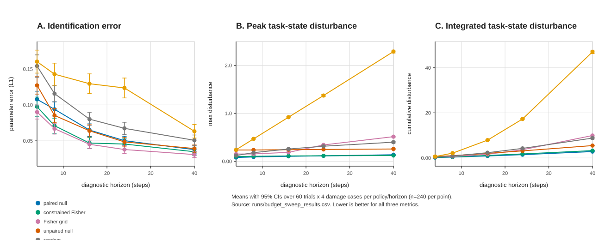
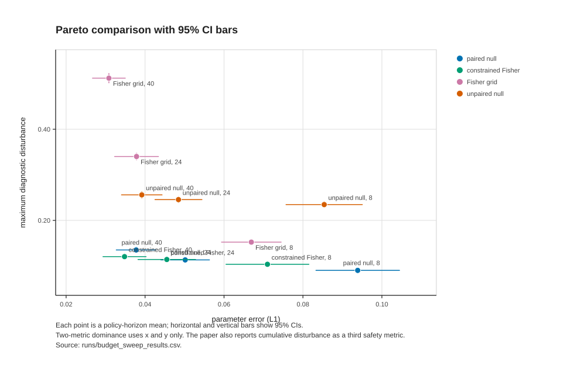
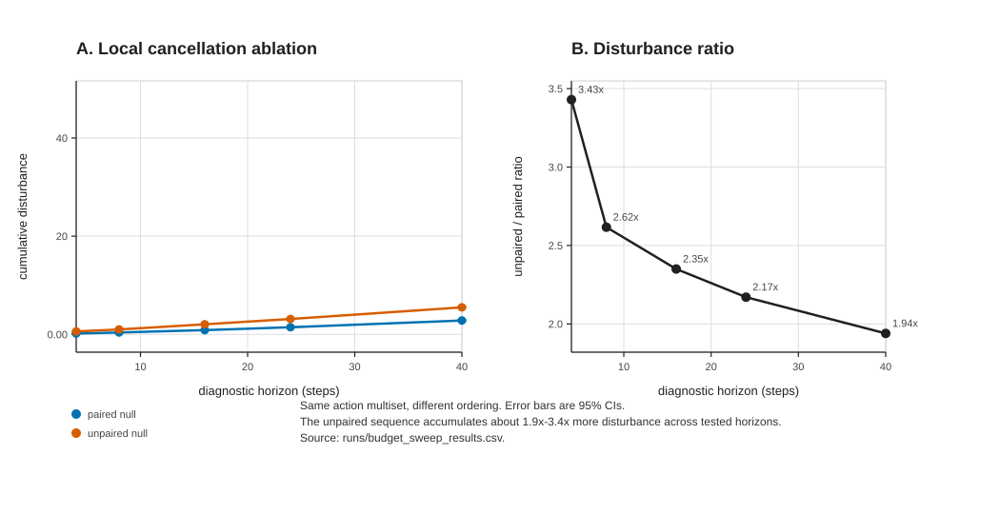

# Embodied Null Probes

Embodied negative controls for low-disturbance robot self-diagnosis.

This repository contains a reproducible simulation study asking whether a robot can diagnose hidden actuator or contact changes by executing paired actions that should cancel under its nominal self-model.

The project is intentionally not optimized for benchmark-winning performance. The central contribution is a falsifiable evaluation protocol: compare diagnostic information against final, maximum, and cumulative task-state disturbance.


## Main Finding

Paired null probes are not the best estimator. Fisher-style baselines often achieve lower parameter error.

The useful result is narrower: paired null probes preserve cumulative task-state disturbance better than unpaired and aggressive probing, and they remain relevant on a three-metric Pareto frontier over:

- parameter error;
- maximum diagnostic disturbance;
- cumulative diagnostic disturbance.

The strongest negative result is also preserved: under high temporally correlated slip and long diagnostic horizons, the cumulative-disturbance advantage can weaken or reverse.

## Figures

All figures are dependency-free SVGs generated from raw CSV logs.



| Figure | File | What It Shows |
|---|---|---|
| 1 | [`figures/fig1_budget_metrics.svg`](figures/fig1_budget_metrics.svg) | Mean parameter error, maximum disturbance, and cumulative disturbance with 95% CIs across diagnostic horizons. |
| 2 | [`figures/fig2_pareto_ci.svg`](figures/fig2_pareto_ci.svg) | Parameter-error vs max-disturbance Pareto comparison with 95% CI bars. |
| 3 | [`figures/fig3_cancellation_ablation.svg`](figures/fig3_cancellation_ablation.svg) | Paired vs unpaired null-action ablation and disturbance ratios. |
| 4 | [`figures/fig4_trajectory_quantified.svg`](figures/fig4_trajectory_quantified.svg) | Representative trajectory plot with numeric trajectory metrics. |
| 5 | [`figures/fig5_robustness_quantified.svg`](figures/fig5_robustness_quantified.svg) | Threshold/noise and correlated-slip robustness with 95% CIs. |

Additional previews:





## Repository Contents

| Path | Purpose |
|---|---|
| `src/diagnostic_null_actions/` | Simulator, policies, experiment runners, analysis, and figure generation. |
| `configs/` | Exact JSON configurations for all runs. |
| `runs/` | Raw CSV logs and generated Markdown summaries. |
| `figures/` | Quantified SVG figures generated from raw logs. |
| `docs/paper_draft.md` | Full first manuscript draft. |
| `docs/references_and_novelty.md` | Prior-art positioning and novelty limitations. |
| `docs/experiment_log.md` | Chronological research log, including negative results and corrections. |
| `docs/preregistration.md` | Internal preregistration and amendments. |
| `docs/artifact_manifest.md` | Manifest of code, configs, results, figures, and verification commands. |

## Quick Start

This package has no runtime dependencies beyond Python 3.11+.

```bash
git clone <your-repo-url>
cd embodied-null-probes
PYTHONPATH=src python -m diagnostic_null_actions.run_experiment configs/base.json
PYTHONPATH=src python -m diagnostic_null_actions.analyze_results runs/base_results.csv --out runs/base_summary.md
```

The base run writes `runs/base_results.csv` and `runs/base_summary.md`.

## Reproduce Paper-Scale Evidence

```bash
PYTHONPATH=src python -m diagnostic_null_actions.run_sweep configs/budget_sweep.json
PYTHONPATH=src python -m diagnostic_null_actions.run_sweep configs/recovery_waypoint_sweep.json
PYTHONPATH=src python -m diagnostic_null_actions.run_sweep configs/threshold_noise_sweep.json
PYTHONPATH=src python -m diagnostic_null_actions.run_sweep configs/correlated_slip_sweep.json

PYTHONPATH=src python -m diagnostic_null_actions.analyze_results runs/budget_sweep_results.csv --out runs/budget_sweep_summary.md
PYTHONPATH=src python -m diagnostic_null_actions.analyze_results runs/recovery_waypoint_sweep_results.csv --out runs/recovery_waypoint_sweep_summary.md
PYTHONPATH=src python -m diagnostic_null_actions.analyze_results runs/threshold_noise_sweep_results.csv --out runs/threshold_noise_sweep_summary.md
PYTHONPATH=src python -m diagnostic_null_actions.analyze_results runs/correlated_slip_sweep_results.csv --out runs/correlated_slip_sweep_summary.md

PYTHONPATH=src python -m diagnostic_null_actions.make_figures --runs runs --out figures
```

Current paper-scale evidence contains 37,440 raw experiment rows, excluding the base sanity run.

## Policies

- `null_probe`: paired commands intended to cancel locally under nominal dynamics.
- `unpaired_null`: same action set as `null_probe`, reordered to break local cancellation.
- `constrained_fisher`: adaptive grid probing under a nominal one-step disturbance constraint.
- `fisher_grid`: repeated high-excitation grid actions.
- `random_probe`: random wheel commands.
- `task_greedy`: task-directed behavior used as a diagnostic data source.

## Metrics

Primary:

- `param_error`: L1 error over left gain, right gain, and slip.
- `max_diagnostic_disturbance`: largest task-state deviation during diagnosis.
- `cumulative_diagnostic_disturbance`: sum of per-step task-state deviations during diagnosis.

Secondary:

- `diagnostic_disturbance`: final diagnostic displacement and heading drift.
- `posterior_entropy`, `posterior_confidence`: grid posterior summaries.
- `recovery_distance`, `recovery_gain`: downstream recovery diagnostics.

## Manuscript

Start here:

- [`docs/paper_draft.md`](docs/paper_draft.md)
- [`docs/references_and_novelty.md`](docs/references_and_novelty.md)
- [`docs/artifact_manifest.md`](docs/artifact_manifest.md)

The draft frames this as a feasibility and boundary-condition paper, not a method-superiority paper.

## Verification

```bash
PYTHONPATH=src python -m compileall -q src tests
PYTHONPATH=src python -m diagnostic_null_actions.make_figures --runs runs --out figures
```

`pytest` is optional; the repository currently includes a smoke test in `tests/test_smoke.py`.

## Citation

See [`CITATION.cff`](CITATION.cff). Update author metadata before public release.

Suggested manuscript title:

```text
Embodied Null Probes: Embodied Negative Controls for Low-Disturbance Robot Self-Diagnosis
```

## License

MIT License. See [`LICENSE`](LICENSE).
